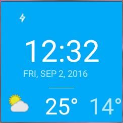

# Sunshine Wearable
_____________________________________________________
Aim : To develop watchface for sunshine app which shows temprature on android wearable watchface.

* Intreactive Mode -  active
* Ambient Mode - battery saving

Build : To built this project you need **OpenWeather API , add in gradle properties file** use Android studio import also update latest sdk and emulator images for wearable support.

Sample screen shot for square device 

This Project is complete no more further extensions , just for refrence sample educational purpose.

**Some code from google under Apache 2.0 , everything else not mentioned under**
**MIT License**

